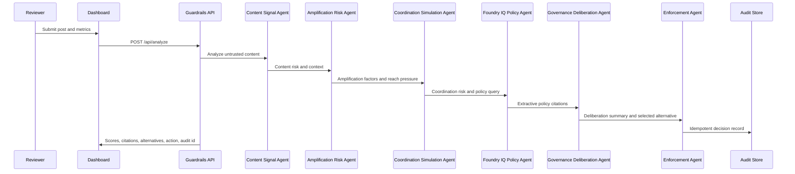

# Architecture

## System goal

Prevent unsafe amplification before it becomes viral damage while preserving user expression through proportionate, explainable actions.

## Runtime components

### Browser dashboard

The dashboard shows:

- post intake
- risk scores
- amplification forecast chart
- coordination simulation visualization
- governance deliberation panel
- alternative actions considered
- visible reasoning timeline
- Foundry IQ policy citations
- audit records

### API server

The Node server exposes:

- `GET /api/health`
- `GET /api/scenarios`
- `GET /api/policies`
- `GET /api/audit`
- `POST /api/analyze`
- `POST /api/audit/:id/rollback`

### Reasoning engine

The engine contains six agent-style stages plus an alternative-action scoring table:

1. `content-signal-agent`
2. `amplification-risk-agent`
3. `coordination-simulation-agent`
4. `foundry-iq-policy-agent`
5. `governance-deliberation-agent`
6. `guardrail-enforcement-agent`

## Decision flow

## Foundry IQ contract

The policy agent expects a retrieval response with:

- citation id
- source
- title
- section
- excerpt
- confidence
- severity

Local mode reads synthetic policies from `src/data/policies.js`. Live mode posts the query to `FOUNDRY_IQ_RETRIEVAL_URL` with medium retrieval reasoning effort and extractive output mode.

## Enforcement ladder

Actions are intentionally proportionate:

- `allow`
- `context_label`
- `source_required_and_label`
- `throttle_and_context_label`
- `human_review`
- `human_review_and_trend_pause`
- `emergency_containment`

## Alternative action scoring

Every action receives:

- safety gain
- policy fit
- restriction cost
- final action score

The governance agent selects the least restrictive option that remains close to the strongest safety option. This makes the app defensible when a judge asks why it did not choose a harsher or weaker intervention.

## Why this is a reasoning agent

The final decision is not produced by one classifier or a fixed pipeline. It depends on the interaction between content risk, amplification risk, coordination risk, retrieved policy evidence, citation confidence, explicit alternative-action scoring, and governance deliberation over the least restrictive effective response.
