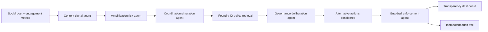

# Social Media Guardrails Reasoning Agent

An agentic safety layer for social media platforms. It assesses unsafe amplification risk, simulates coordinated behavior, retrieves policy evidence through a Foundry IQ style knowledge layer, deliberates over alternative actions, and applies the least restrictive effective guardrail with citations and an audit trail.

This project is designed for the Microsoft Agents League Hackathon, Reasoning Agents track.

## Why this can score well

- **Reasoning Agents:** the app does not stop at content classification. It runs a visible multi-step workflow: content signals, amplification risk, coordination simulation, policy retrieval, governance deliberation, alternative-action scoring, and enforcement.
- **Foundry IQ:** the policy grounding layer follows the Foundry IQ pattern: multi-source knowledge evidence, extractive citations, role-aware retrieval metadata, and a live retrieval adapter for a configured knowledge base endpoint.
- **Reliability and safety:** every action is idempotent, auditable, explainable, reversible when safe, and intentionally proportionate.
- **Responsible AI framing:** the agent avoids binary censorship language. It prioritizes labels, friction, source requirements, throttling, and human review before removal.

Official Microsoft references used for alignment:

- Foundry IQ overview: https://learn.microsoft.com/en-us/azure/ai-foundry/agents/concepts/what-is-foundry-iq?view=foundry
- Foundry IQ FAQ: https://learn.microsoft.com/en-us/azure/ai-foundry/agents/concepts/foundry-iq-faq?view=foundry
- Microsoft Foundry Agent Service: https://learn.microsoft.com/azure/ai-foundry/agents/overview
- Azure AI Content Safety overview: https://learn.microsoft.com/en-us/azure/ai-services/content-safety/overview
- Microsoft Responsible AI principles: https://www.microsoft.com/en-us/ai/principles-and-approach

## Run locally

Requires Node.js 18 or newer.

```powershell
npm test
npm start
```

Open http://localhost:4173.

No third-party packages are required for the local demo.

## Demo flow

1. Select **Civic rumor with fast spread**.
2. Click **Analyze**.
3. Show the four scores: content risk, amplification risk, coordination risk, and governance risk.
4. Walk through the governance deliberation panel.
5. Show alternative actions considered and why the selected option is least restrictive.
6. Open the policy citations and point to Foundry IQ grounding.
7. Close with the audit trail, rollback button, and idempotency controls.

The strongest judge sentence:

> Before unsafe amplification spreads, our reasoning agent assesses reach pressure, simulates coordination, retrieves grounded policy through Foundry IQ, deliberates over alternative actions, chooses the least restrictive effective intervention, and logs an auditable explanation.

## Architecture



## API

### `POST /api/analyze`

Request:

```json
{
  "postText": "Breaking: polling locations changed tonight...",
  "author": {
    "handle": "@citywatch_now",
    "accountAgeDays": 46,
    "followerCount": 42000,
    "verified": false,
    "priorViolations": 1
  },
  "metrics": {
    "minutesSincePosted": 18,
    "likes": 3100,
    "shares": 2600,
    "replies": 780,
    "reports": 61
  },
  "context": {
    "topic": "election",
    "eventWindow": "active",
    "region": "demo-region",
    "language": "en",
    "mediaType": "text"
  },
  "actor": {
    "role": "public-demo"
  }
}
```

Response includes:

- `contentSignals`
- `amplificationRisk`
- `botSimulation`
- `foundryIq.citations`
- `alternativeActions`
- `governanceDeliberation`
- `enforcement`
- `reasoningTimeline`
- `auditRecord`

## Foundry IQ integration

Local mode uses `src/data/policies.js`, a synthetic policy corpus that mirrors the Foundry IQ contract for hackathon demo development. This keeps the app runnable without uploading confidential data.

For final hackathon submission, connect a real Foundry IQ / Azure AI Search knowledge base:

1. Create a Foundry IQ knowledge base with synthetic or public policy documents.
2. Use extractive retrieval so the agent reasons over cited policy snippets.
3. Configure the app:

```powershell
$env:FOUNDRY_IQ_MODE="live"
$env:FOUNDRY_IQ_RETRIEVAL_URL="<your exact knowledge base retrieval endpoint>"
$env:FOUNDRY_IQ_API_KEY="<optional if required>"
$env:FOUNDRY_IQ_BEARER_TOKEN="<optional if required>"
npm start
```

> [!NOTE]
> Set `FOUNDRY_IQ_MODE=live` with your Azure AI Search endpoint for production use. If not set (or left as `mock`), the reasoning engine will utilize the local synthetic policy corpus (**`local-policy-corpus`**) instead of the live API.


The app sends:

- `query`
- `context`
- `retrievalReasoningEffort: "medium"`
- `outputMode: "extractiveData"`

If live retrieval fails, the API falls back to the local synthetic corpus and returns a warning. For the final judge demo, show live retrieval working or clearly disclose local demo mode.

## Explainable Scoring Heuristics & Weights

The reasoning agent does not rely on opaque deep learning model scores alone. Instead, it utilizes transparent, multi-dimensional heuristic models for amplification risk and coordination simulation. This allows every decision to be fully explainable and auditable.

### 1. Amplification Risk Weights

The amplification risk score is computed as a weighted sum of six key indicators:

*   **Engagement Velocity (28%):** *Rationale:* The rate of interaction (likes, shares, reports per minute) is the most critical operational predictor of propagation. High velocity requires rapid preventative mitigation.
*   **Topic Sensitivity (20%):** *Rationale:* Critical civic areas (e.g., elections, public safety) have a disproportionately high risk of societal harm and viral misinformation.
*   **Emotional Intensity (16%):** *Rationale:* Language with high emotional valence (e.g., urgency terms, calls to action) is psychologically proven to increase user sharing rates.
*   **Novelty & Source Uncertainty (16%):** *Rationale:* Unverified claims or leaks lacking reliable citation sources have higher rumor-spread risk. Verified badges act as a negative modifier (safety boost).
*   **Polarization Pressure (12%):** *Rationale:* Divisive us-vs-them language and report density indicate elevated conflict risk.
*   **Network Reach (8%):** *Rationale:* Author follower count dictates baseline potential exposure, providing the initial audience reach scale.

### 2. Coordination Simulation Weights

The coordination score identifies potential inauthentic bot networks using six indicators:

*   **Synchronized Engagement (22%):** *Rationale:* Coordinated bursts or programmatic metadata flags indicate automated/orchestrated network behavior.
*   **Coordinated Timing & Phrasing (20%):** *Rationale:* Repeated phrases, identical timestamps, or lexicon markers (e.g., "mass report", "bot army").
*   **Repost Density (18%):** *Rationale:* A highly skewed share-to-like ratio is a classic indicator of automated amplification script activity.
*   **Follower Anomalies (16%):** *Rationale:* Brand-new or low-age accounts executing high-volume actions.
*   **Engagement Spikes (16%):** *Rationale:* Sudden, non-linear surges in engagement metrics.
*   **Report Pressure (8%):** *Rationale:* Community flagging signals indicating user-detected coordination.

## Safety design

- Synthetic demo data only.
- No confidential data required.
- User-generated content is treated as untrusted input.
- High-risk low-citation cases route to human review.
- The agent uses least restrictive intervention first.
- Every applied decision has an idempotency key and audit record.
- The dashboard shows citations instead of hidden reasoning.

## Limitations

- The amplification risk model is a transparent heuristic for demo purposes, not a production prediction system.
- The coordination simulation is a risk model, not a forensic attribution engine.
- The local policy corpus is synthetic. Use real Foundry IQ policy sources for official submission.
- Production moderation requires fairness testing, appeals operations, reviewer tooling, and jurisdiction-specific legal review.
