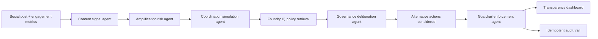

# Social Media Guardrails Reasoning Agent

Social Media Guardrails Committee is a multi-agent governance system that helps platforms make transparent, policy-grounded moderation decisions.
Instead of asking only whether content is harmful, the system determines the least restrictive effective intervention by combining content analysis, amplification risk assessment, coordination detection, policy retrieval, governance deliberation, and auditable enforcement.

This project is designed for the Microsoft Agents League Hackathon 2026, Reasoning Agents track.

## Innovation Highlights

### Multi-Agent Governance
Rather than producing a single moderation score, the system uses specialized agents to evaluate content risk, amplification pressure, coordination signals, policy grounding, governance outcomes, and enforcement actions.
### Policy-Grounded Decisions
Governance recommendations are supported by policy evidence and citations, enabling transparent and auditable decision making.
### Least Restrictive Effective Action
The platform prioritizes proportionate interventions such as context labels, source requirements, throttling, and human review before considering stronger enforcement actions.
### Explainable Governance
Every recommendation includes supporting evidence, alternative actions considered, and a complete audit trail for review and rollback.

## Run locally

Requires Node.js 18 or newer.

```powershell
npm test
npm start
```

Open http://localhost:4173.

No third-party packages are required for the local demo.

## Architecture



## API

### `POST /api/analyze`

Request:

```json
{
  "postText": "Breaking: polling locations changed tonight...",
  "author": {
    "handle": "@citywatch_now",
    "accountAgeDays": 46,
    "followerCount": 42000,
    "verified": false,
    "priorViolations": 1
  },
  "metrics": {
    "minutesSincePosted": 18,
    "likes": 3100,
    "shares": 2600,
    "replies": 780,
    "reports": 61
  },
  "context": {
    "topic": "election",
    "eventWindow": "active",
    "region": "demo-region",
    "language": "en",
    "mediaType": "text"
  },
  "actor": {
    "role": "public-demo"
  }
}
```

Response includes:

- `contentSignals`
- `amplificationRisk`
- `botSimulation`
- `foundryIq.citations`
- `alternativeActions`
- `governanceDeliberation`
- `enforcement`
- `reasoningTimeline`
- `auditRecord`

## Foundry IQ integration

Local mode uses `src/data/policies.js`, a synthetic policy corpus that mirrors the Foundry IQ contract for hackathon demo development. This keeps the app runnable without uploading confidential data.

For final hackathon submission, connect a real Foundry IQ / Azure AI Search knowledge base:

1. Create a Foundry IQ knowledge base with synthetic or public policy documents.
2. Use extractive retrieval so the agent reasons over cited policy snippets.
3. Configure the app:

```powershell
$env:FOUNDRY_IQ_MODE="live"
$env:FOUNDRY_IQ_RETRIEVAL_URL="<your exact knowledge base retrieval endpoint>"
$env:FOUNDRY_IQ_API_KEY="<optional if required>"
$env:FOUNDRY_IQ_BEARER_TOKEN="<optional if required>"
npm start
```

> [!NOTE]
> Set `FOUNDRY_IQ_MODE=live` with your Azure AI Search endpoint for production use. If not set (or left as `mock`), the reasoning engine will utilize the local synthetic policy corpus (**`local-policy-corpus`**) instead of the live API.


The app sends:

- `query`
- `context`
- `retrievalReasoningEffort: "medium"`
- `outputMode: "extractiveData"`

If live retrieval fails, the API falls back to the local synthetic corpus and returns a warning. For the final judge demo, show live retrieval working or clearly disclose local demo mode.

## Explainability

The platform uses transparent scoring models rather than opaque moderation decisions. Risk assessments are generated from multiple explainable signals including amplification pressure, coordination indicators, source uncertainty, engagement velocity, and topic sensitivity.

Detailed scoring methodology is available in docs/scoring-model.md.

## Safety design

- Synthetic demo data only.
- No confidential data required.
- User-generated content is treated as untrusted input.
- High-risk low-citation cases route to human review.
- The agent uses least restrictive intervention first.
- Every applied decision has an idempotency key and audit record.
- The dashboard shows citations instead of hidden reasoning.

## Limitations

- The amplification risk model is a transparent heuristic for demo purposes, not a production prediction system.
- The coordination simulation is a risk model, not a forensic attribution engine.
- The local policy corpus is synthetic. Use real Foundry IQ policy sources for official submission.
- Production moderation requires fairness testing, appeals operations, reviewer tooling, and jurisdiction-specific legal review.
